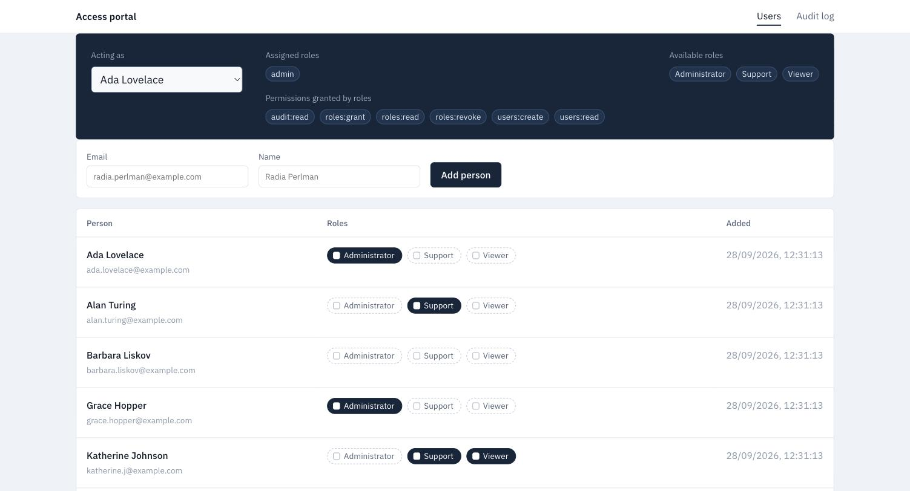
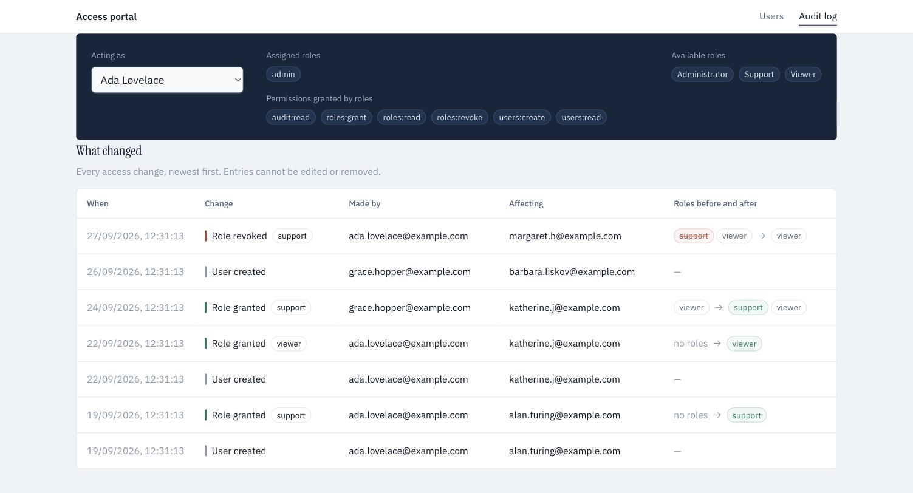

# Access Provisioning & Audit Portal

An internal tool for managing user roles and permissions, with an append-only audit log
of who changed what, and when.

## Tech stack

- **TypeScript 6** — programming language used across backend and frontend
- **Node 24 + Express 5** — the backend runtime and framework
- **Postgres 16** — the database, accessed through **`pg`** with raw parameterised SQL
  (no ORM)
- **Zod 4** — request validation
- **Vue 3 + Vite** — frontend framework and build tool
- **Vitest + Supertest** — the test suite, run against a real database
- **nginx** — serves the built frontend and proxies `/api` to the backend
- **Docker Compose** — runs the database, backend and frontend as three containers

## Contents

- [Quickstart](#quickstart)
- [Testing](#testing)
- [API endpoints](#api-endpoints)
- [Permissions resolution](#permissions-resolution)
- [Trade-offs](#trade-offs)
- [UX](#ux)

---

## Quickstart

**1. Install Docker**

[Docker Desktop](https://docs.docker.com/desktop/), or Docker Engine with Compose v2.

**2. Check port 8080 is free**

It is the only port published. If you need a different one, set `WEB_PORT` in a `.env` at
the project root — see `.env.example`:

```bash
echo "WEB_PORT=9090" >> .env
```

**3. Start the app**

```bash
docker compose up
```

Postgres, the API and nginx start in order. The database is created, migrated and seeded
as the API starts.

Open **http://localhost:8080** — or whichever port you set.

**4. Stop it**

```bash
docker compose down         # stop, keeping the data
docker compose down -v      # stop and wipe the database
```

`docker compose up -d` starts it in the background instead, leaving the terminal free.

---

## Testing

48 tests covering every endpoint, the permission checks, and the audit log's
append-only rules. They run on the host, so Node 24 is needed as well as Docker.

```bash
cp backend/.env.example backend/.env
docker compose -f docker-compose.yml -f docker-compose.test.yml up -d postgres
npm --prefix backend ci
npm --prefix backend test
```

Note: the tests expect a database with the seed data, so run `docker compose down -v`
first if you have been clicking around.

---

## API endpoints

| Method | Path               | Permission required                  |
| ------ | ------------------ | ------------------------------------ |
| `GET`  | `/health`          | none — the container healthcheck     |
| `GET`  | `/me`              | none beyond a resolvable actor       |
| `GET`  | `/users`           | `users:read`                         |
| `POST` | `/users`           | `users:create`                       |
| `PUT`  | `/users/:id/roles` | `roles:grant` **and** `roles:revoke` |
| `GET`  | `/roles`           | `roles:read`                         |
| `GET`  | `/audit-logs`      | `audit:read`                         |

`backend/requests.http` has a runnable request for every endpoint, including the failure
cases.

---

## Permissions resolution

1. Every request except `/health` sends the user's id in an `X-Actor-Id` header.
2. `resolveActor` middleware resolves that id into a user, with their granted roles and
   permissions, in one query. Note that authentication is out of scope for this project:
   the backend trusts the caller is who they say they are.
3. Each route declares the permission keys it requires, for example:
   `requirePermission(PERMISSIONS.ROLES_GRANT, PERMISSIONS.ROLES_REVOKE)`.
4. `requirePermission` middleware allows the request only if the resolved user holds every
   requested permission key, otherwise it returns 403 naming the missing permissions.
5. A `GET /me` endpoint returns the selected user's roles and permissions, so the UI can
   render what that user is allowed to do. This is presentation only — the API checks
   permissions again on every request.

---

## Trade-offs

**Monorepo tooling.**

- The application has a `shared/` folder holding the API contracts, permission keys and
  error codes used by both sides. It is not a real npm package, so the frontend and
  backend reach it by relative path — the users view imports it as
  `../../../../shared/contract.js`. It has no `node_modules` either, so a dependency like
  zod cannot resolve from inside it: four files have to point at a copy instead, through
  `paths` in three tsconfigs and an alias in `vite.config.ts`.
- Given more time we would set the project up as a proper monorepo: npm workspaces, so
  `shared/` becomes a real package installed once and imported by name rather than by
  path, with a build tool like Turborepo on top. That gives one place at the root to run
  build, test and lint across every package, run in dependency order rather than by hand,
  and a cache so packages that have not changed are not rebuilt — locally and in CI. It
  would also be a good foundation for splitting into `apps/` and `packages/` as the
  codebase grows.

**Authentication.**

- The application intentionally does not implement authentication, due to time
  constraints and project scope. This means the `X-Actor-Id` header value is implicitly
  trusted on each request.
- Given more time we would either implement SSO with an identity provider using OIDC,
  where the user's identity comes from the claims in the token the provider issues, or
  handle authentication in the app itself with local accounts. Either way the app
  establishes a session (a session cookie or a JWT) and `resolveActor` reads the user id
  from that session instead of a header.

**No DB ORM.**

- We chose to use a Postgres driver directly (`pg`) and write the SQL by hand, rather
  than use an ORM like Prisma or Drizzle. The application is small enough that writing
  the SQL by hand is manageable, it is easier to reason about and explain the database
  logic in raw SQL, and the features planned after the schema was decided — locking role
  changes, ensuring audit records are append-only — would need raw SQL anyway, even with
  an ORM.
- If the schema and the team grew, an ORM would start to make sense: types generated from
  the schema, and one obvious way to write queries so they do not diverge in style
  between developers.

**Pagination.**

- None of the endpoints paginate. `GET /audit-logs` returns the newest 200 entries,
  meaning anything older is unreachable, and `GET /users` returns every record, which
  would create performance issues as the database grows.
- Given more time we would implement cursor-based pagination, where each page asks for
  the entries after the last one returned. The index it needs,
  `(occurred_at desc, id desc)`, already exists.

---

## UX

**Users view** — shows who you are acting as, the roles and permissions that person
holds, and a table of every user. Roles can be granted and revoked in place, and new
users added.



**Audit log view** — shows every access change, newest first: users added, roles granted
and roles revoked, with the roles held before and after.


